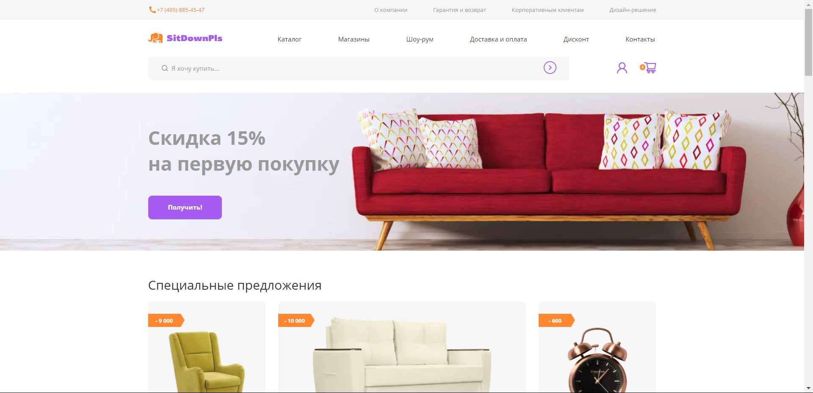
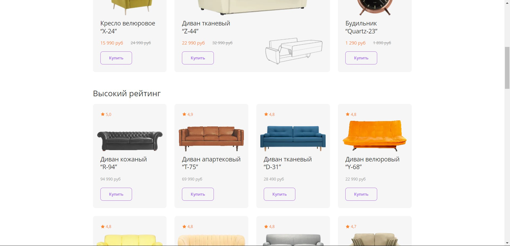
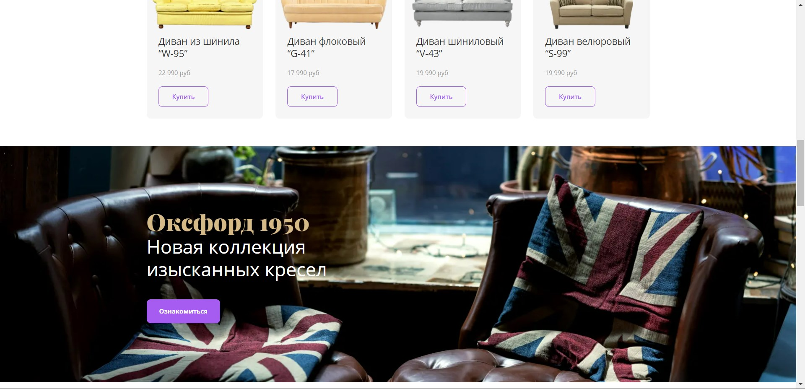
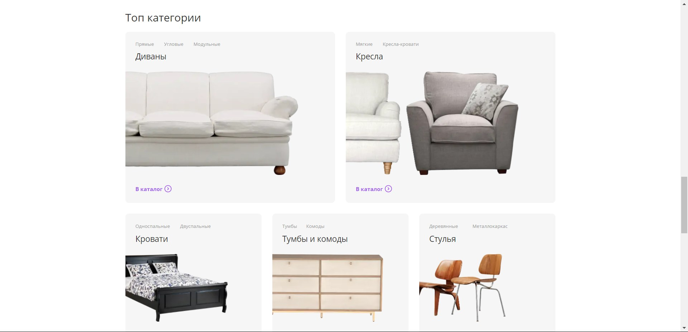
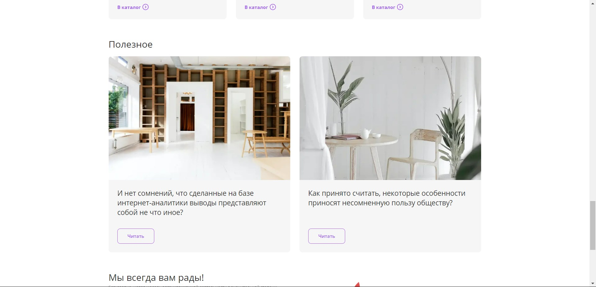
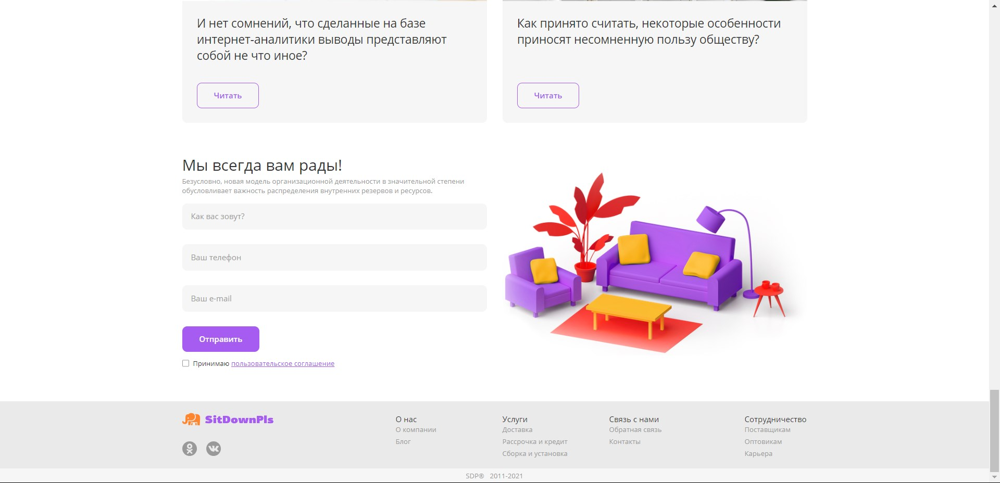
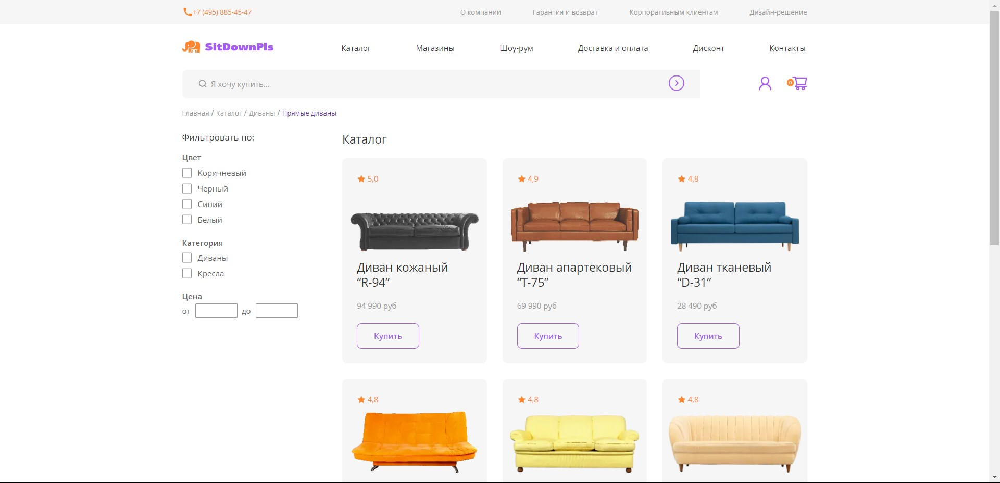
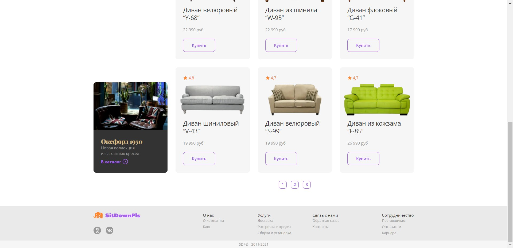
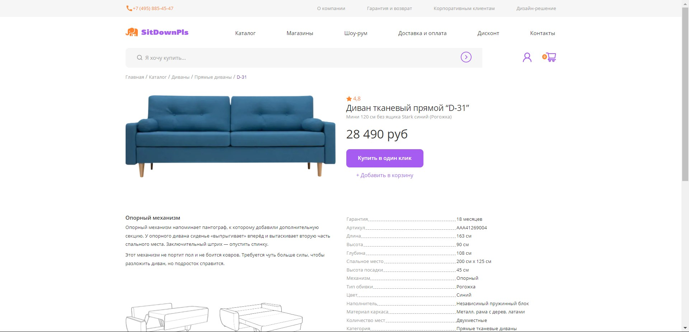
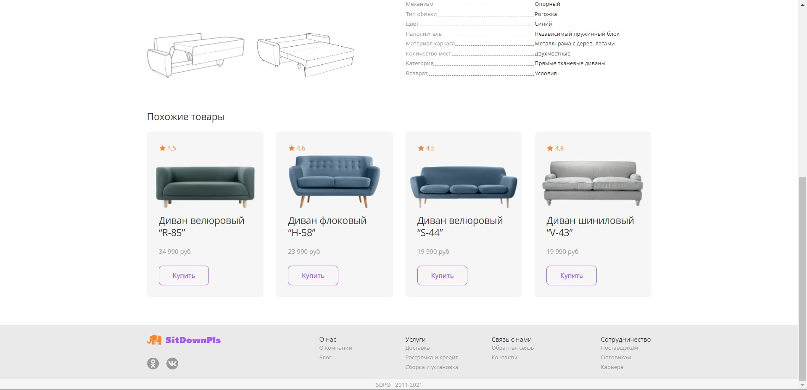

#  Вёрстка для проекта «SitDownPls — интернет-магазин мебели»

## Содержание
- [Технологии](#технологии)
- [Начало работы](#разработка)
- [Визуал](#скриншоты)

## Технологии
- [Gulp](https://gulpjs.com/)

### Требования
Для установки и запуска проекта, необходим [NodeJS](https://nodejs.org/) v8+.

## Разработка
### Установка зависимостей
Для установки зависимостей, выполните команду:
```sh
$ npm i
```

### Запуск Development сервера
Чтобы запустить сервер для разработки, выполните команду:
```sh
npm run dev
```

### Создание билда
Чтобы выполнить production сборку, выполните команду: 
```sh
npm run build
```

## Скриншоты
  
  
  
  
  
  
  
  
  
  

## Команда проекта
- [Артём Кряквин](https://t.me/art_kryy) — Frontend-developer
